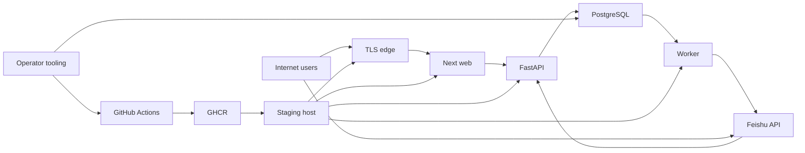

# Muchen Journey vNext Threat Model

## Executive summary

Muchen Journey vNext is an internet-reachable, organization-scoped learning and review workflow whose highest risks are account/session takeover, cross-organization or cross-object authorization failure, unauthorized mutation of immutable business facts, compromise of the CI-to-runtime candidate chain, and data loss while Alpha intentionally lacks an independent disaster-recovery fault domain. Existing controls are substantial: server-side role/object scoping, revocable hashed sessions, CSRF, bounded OAuth state, strict schemas, immutable history, non-root containers, pinned candidate artifacts, and fail-closed nonlocal configuration. Residual Alpha risks remain time-bounded by DEC-018/019 and keep production `NO_GO`.

## Scope and assumptions

- In scope: `apps/api`, `apps/web`, `apps/worker`, `deploy/staging`, `.github/workflows`, migrations, release/operations scripts, and security-relevant configuration contracts.
- Runtime in scope: public TLS edge, Next.js server, FastAPI API, PostgreSQL, notification worker, Feishu identity integration, and the currently disabled attachment/notification paths that could alter risk if enabled.
- Build/operations in scope: protected GitHub main, Actions, candidate packaging/SBOM, GHCR images, frozen staging deployment contract, and bounded operator scripts.
- Out of scope: the legacy Muchen Journey runtime, production execution that has not been authorized, AI processing, historical business-data import, and real attachment/notification delivery while DEC-017/018 keep those capabilities disabled or deferred.
- Assumption: Alpha is a small, single-enterprise invited cohort, but organization isolation is still treated as a high-impact security boundary because the data model and authorization layer support multiple organizations.
- Assumption: submissions, reviews, outcomes, identity links, and audit records are enterprise-confidential; regulated health, payment, government-ID, or customer production data is not expected. If that changes, confidentiality impact must be re-ranked.
- Assumption: any anonymous internet client, leaked invite recipient, compromised invited user, or compromised Feishu account is untrusted.
- User clarification: DEC-019 explicitly accepts no independent Alpha DR fault domain until 30 consecutive stable days; this is a time-bounded risk, not a control.
- User did not directly amend the single-enterprise and enterprise-confidential assumptions when asked; this model uses the conservative interpretations above.
- Open question for later review: whether production will remain single-enterprise or onboard separately administered organizations; multiple tenant administrators would increase identity-link and operator-abuse likelihood.

## System model

### Primary components

- Public edge: Caddy terminates TLS and routes traffic to the Web service (`deploy/staging/Caddyfile`, `deploy/staging/compose.yaml`).
- Web: Next.js server renders Learner, Reviewer, and Operator flows and forwards same-origin authenticated API requests (`apps/web/src/app`, `apps/web/src/lib/api.ts`).
- API: FastAPI exposes health, invite, identity, assignment, submission, review, outcome, operations, and Feishu OAuth routes (`apps/api/journey_api/main.py:app`).
- Database: PostgreSQL stores organizations, users, roles, sessions, immutable submissions/evaluations/outcomes, Outbox state, audit records, and idempotency facts (`apps/api/journey_api/models.py`, `migrations`).
- Worker: claims Outbox events and records retry/dead/delivery facts; Feishu delivery is a bounded external side effect (`apps/worker/journey_worker/main.py`, `apps/worker/journey_worker/feishu.py`).
- Feishu identity provider: authenticates Reviewer/Operator accounts through a dedicated application and callback (`apps/api/journey_api/oauth_routes.py`, `apps/api/journey_api/feishu_oauth.py`).
- Candidate supply chain: GitHub Actions validates source, builds SBOMs/images, pushes immutable GHCR digests, and supplies the frozen staging workflow (`.github/workflows/ci.yml`, `.github/workflows/mainline.yml`, `.github/workflows/staging.yml`).

### Data flows and trust boundaries

- Internet → Caddy → Next.js: browser requests, invite tokens, cookies, OAuth query values, and user-entered text cross public TLS. Host allowlists, security headers, CSP nonce, root-relative redirects, and bounded request handling apply (`deploy/staging/Caddyfile`, `apps/web/src/middleware.ts`, `apps/web/src/lib/api.ts`).
- Next.js → FastAPI: session/CSRF cookies, role-scoped commands, idempotency keys, and JSON cross the application boundary over the private Compose network. FastAPI uses strict Pydantic schemas, server-side auth, CSRF checks, role checks, and organization/object filters (`apps/api/journey_api/auth.py:get_actor`, `apps/api/journey_api/schemas.py`).
- FastAPI → PostgreSQL: identity and business facts cross a privileged database boundary. SQLAlchemy parameterization, transactions, foreign keys/checks, immutable-history services, and a DML-only runtime role reduce injection and integrity risk (`apps/api/journey_api/db.py`, `apps/api/journey_api/models.py`, `deploy/staging/grant_runtime.py`).
- Browser → Feishu → FastAPI callback: OAuth code/state and a stable Feishu subject cross two external boundaries. The flow binds state to a browser cookie, limits state lifetime/use, fixes the callback/return path, rotates sessions, and supports revocation (`apps/api/journey_api/oauth_routes.py`, `apps/api/journey_api/feishu_oauth.py`).
- PostgreSQL → Worker → Feishu messaging API: Outbox facts, encrypted recipient identity, minimal message content, provider tokens, and receipt identifiers cross asynchronous and external-provider boundaries. Claims are transactional, retries bounded, credentials dedicated, destinations fixed, and failures cannot rewrite outcomes (`apps/worker/journey_worker/main.py`, `apps/worker/journey_worker/feishu.py`).
- Developer PR → GitHub Actions → GHCR → staging host: source, workflow authority, secrets, SBOMs, image digests, and release manifests cross the software-supply-chain boundary. Protected main, required checks, pinned actions/images, secret/dependency scans, digest verification, and exact candidate confirmation apply (`.github/workflows/mainline.yml`, `scripts/wp07_candidate.py`, `scripts/wp08_prepare_deploy.py`).
- Operator tools → repository/database: bounded audit, seed, import, deployment, and recovery commands cross a privileged operational boundary. Nonlocal import is disabled, intent/confirmation values are exact, reports are PII-free, and production mutation remains unsupported (`apps/api/journey_api/offline_import.py:verify_package`, `scripts/wp06_ops.py`, `scripts/wp08_staging.py`).

#### Diagram

## Assets and security objectives

| Asset | Why it matters | Security objective (C/I/A) |
| --- | --- | --- |
| Session, invite, OAuth-state and CSRF credentials | Control access to Learner, Reviewer, and Operator identities | C/I |
| Feishu App secrets and subject/recipient keys | Permit identity assertion, subject pseudonymization, and external delivery | C/I |
| Organization, role, enrollment and assignment scope | Prevents cross-organization and cross-role access | I/C |
| Submission, evaluation, outcome and handoff history | Records accepted user and reviewer facts that must not be rewritten | I/A |
| PostgreSQL data and migration state | Primary source of identity, workflow and audit truth | C/I/A |
| Audit, idempotency and Outbox history | Proves mutations, blocks replay and supports incident reconstruction | I/A |
| Candidate manifest, SBOM and image digests | Bind reviewed source to deployed runtime | I/A |
| Availability and recoverability evidence | Keeps the real user loop usable and data recoverable | A/I |

## Attacker model

### Capabilities

- Send arbitrary unauthenticated HTTP requests to the public staging domain and replay any leaked invite or OAuth URL before expiry.
- Operate a legitimately invited Learner account, or a compromised Reviewer/Operator Feishu account, and manipulate all browser-controlled fields, IDs, headers, timing, and concurrency.
- Attempt CSRF, open redirect, state replay, session fixation, object-ID swapping, idempotency races, resource exhaustion, and malformed provider responses.
- Publish malicious dependency versions or exploit a compromised developer/GitHub credential if upstream account controls fail.
- Cause individual service, database, provider, or regional availability failures.

### Non-capabilities

- No assumed shell, cloud-console, database-superuser, GitHub-admin, Feishu-tenant-admin, or secret-store access.
- No assumed ability to break TLS, HMAC/SHA-256, AES-GCM, or cryptographically secure random tokens.
- No production environment, real attachment path, historical import, AI integration, or business notification recipient is active in the modeled Alpha.
- The legacy system is not reachable through an approved vNext runtime path.

## Entry points and attack surfaces

| Surface | How reached | Trust boundary | Notes | Evidence (repo path / symbol) |
| --- | --- | --- | --- | --- |
| Public Web routes | HTTPS through Caddy | Internet → Edge/Web | Learner, Reviewer, Operator and auth error states | `deploy/staging/Caddyfile`; `apps/web/src/app` |
| Invite exchange and identity confirmation | Public/API POST | Internet → API | Token, CSRF and one-time join context | `identity_routes.py:exchange_invite`; `identity_routes.py:confirm_identity` |
| Session-authenticated API | Same-origin Web/API | Web → API | Cookie session, CSRF, role and organization scope | `auth.py:get_actor`; `main.py:app` |
| Feishu OAuth start/callback | Browser and provider | Internet/Feishu → API | Browser binding, one-time state, role-specific link | `oauth_routes.py:start_oauth`; `oauth_routes.py:oauth_callback` |
| Submission/revision commands | Learner API | Web → API/DB | Immutable versions, idempotency and assignment scope | `submission_routes.py`; `submission_service.py` |
| Review/finalize commands | Reviewer API | Web → API/DB | Explicit reviewer assignment and fixed submission version | `review_routes.py`; `outcome_service.py` |
| Operator commands | Operator API | Web → API/DB | Invites, identity links, scope changes, redrive and audit | `ops_routes.py`; `identity_routes.py` |
| Outbox worker and Feishu delivery | Background DB polling | DB → Worker → Feishu | Retry, DEAD, encrypted recipient and receipt | `apps/worker/journey_worker/main.py`; `feishu.py` |
| Attachment routes | Disabled in Alpha | Browser/API → Storage/scanner | High-risk feature is fail-closed by DEC-017 | `submission_routes.py`; `attachments.py`; `config.py` |
| Offline import | Local/test CLI only | Operator file → DB | Signed, bounded, exact schema; disabled nonlocal | `offline_import.py:verify_package` |
| CI and deployment workflows | GitHub event/manual dispatch | Developer/GitHub → GHCR/host | Candidate integrity and privileged secrets | `.github/workflows/mainline.yml`; `.github/workflows/staging.yml` |

## Top abuse paths

1. Account takeover → steal an unexpired invite or Feishu link → complete identity/session exchange in another browser → act as the victim. Browser-bound OAuth state, short link TTLs, one-time use and session rotation reduce but do not eliminate link theft risk.
2. Cross-organization read/write → authenticate as a valid user → replace an object ID with another organization’s ID → reach a query missing an organization predicate → disclose or mutate confidential workflow facts.
3. Reviewer integrity abuse → compromise a Reviewer account → access an explicitly assigned case → submit a misleading evaluation or race expected revisions → create an incorrect outcome. Immutable history aids detection but cannot determine reviewer intent.
4. Operator privilege abuse → compromise Operator Feishu identity → create/revoke identity links or invites → bind a controlled Feishu subject to a privileged internal user → obtain durable privileged sessions.
5. Business-fact replay → resend a previously accepted mutation with altered payload or conflicting idempotency key → exploit a missing expected revision or dedupe check → create duplicate/out-of-order facts.
6. Supply-chain substitution → compromise a developer or workflow dependency → alter source/workflow or publish a lookalike image → deploy code that bypasses application controls. Required PR checks and digest-bound candidates are the primary choke points.
7. Observability evasion → trigger permission probes or worker failures while Alpha external collection/alerts are deferred → remain undetected between bounded host audits → increase time to containment.
8. Data-loss event → database/host/region failure occurs before an independent DR fault domain exists → local or same-fault-domain recovery is unavailable → exceed RPO/RTO and lose Alpha facts. DEC-019 accepts this only for Alpha and keeps production blocked.

## Threat model table

| Threat ID | Threat source | Prerequisites | Threat action | Impact | Impacted assets | Existing controls (evidence) | Gaps | Recommended mitigations | Detection ideas | Likelihood | Impact severity | Priority |
| --- | --- | --- | --- | --- | --- | --- | --- | --- | --- | --- | --- | --- |
| TM-001 | Anonymous attacker or link thief | Obtains an unexpired invite/OAuth link or browser context | Replays or completes identity exchange as the intended user | Account takeover and unauthorized workflow access | Sessions, roles, submissions | Hashed one-time tokens, bounded TTL, CSRF, browser-bound OAuth state, session rotation/revocation (`identity_routes.py`, `oauth_routes.py`, `auth.py`) | Link delivery channel and user device remain outside app control | Keep 15–30 minute TTLs, rate-limit exchange by IP/token fingerprint, surface last-login/revoke controls, test browser mismatch and replay every RC | Count exchange failures, replay decisions, session revocations and identity-link changes without logging token/subject | Medium | High | high |
| TM-002 | Authenticated malicious user | Valid account plus guessed/leaked object ID | Exploits any query missing organization/object predicate | Cross-organization disclosure or mutation | All tenant business and identity data | Organization joins and explicit predicates in auth/routes; negative tests and DB constraints (`auth.py:get_actor`, `routes.py`, `ops_routes.py`, migrations) | Defense is distributed across route queries; no database row-level security | Maintain a route-to-scope test matrix; centralize reusable scoped loaders; consider PostgreSQL RLS before multi-admin production | Alert on object-scope rejects and invariant checks where related rows disagree on organization | Medium | High | high |
| TM-003 | Compromised Learner/Reviewer/Operator | Valid role and target object access | Races or replays commands to create conflicting workflow facts | Incorrect evaluations/outcomes or duplicated side effects | Submission, evaluation, outcome, Outbox | Expected revisions, idempotency records, row locks, immutable history and transactional Outbox (`idempotency.py`, `submission_service.py`, `outcome_service.py`) | Manual review intent cannot be cryptographically verified; retention jobs not yet implemented | Add concurrency/property tests for every mutation; preserve actor/reason/revision; require step-up or dual review for emergency corrections | Detect repeated conflicts, idempotency payload mismatch, unusual finalize/revoke volume | Medium | High | high |
| TM-004 | Compromised Operator or Feishu account | Operator session or ability to approve an identity link | Links attacker-controlled Feishu identity to Reviewer/Operator, then creates sessions | Privilege escalation and durable control-plane access | Identity links, privileged sessions | Operator-only link commands, role/org validation, one active link, one-time link, session revocation and audit (`identity_routes.py`, `oauth_routes.py`) | Single Operator can perform high-impact identity changes in Alpha | Require re-authentication and two-person approval for production privileged link changes; notify affected identity out-of-band | High-severity audit event on privileged link create/replace/revoke and mass session revocation | Low | High | high |
| TM-005 | Dependency or credential compromise | GitHub/developer credential or build dependency compromised | Alters workflow/source or substitutes image/artifact | Full application/control bypass | Candidate, images, secrets, all runtime assets | Protected main, required CI, pinned actions/images, SBOM, scans, full-SHA manifest and registry digest verification (`mainline.yml`, `wp07_candidate.py`) | Public repo increases reconnaissance; GitHub account governance is single-owner | Enable phishing-resistant MFA/passkeys, separate release approver, review action pin updates, sign/verify images before production | GitHub audit log, unexpected workflow/permission diff, digest mismatch and candidate drift gate | Low | High | high |
| TM-006 | Failure, ransomware or operator error | Destructive event affects current database/host/fault domain | Makes primary data unavailable before independent copy/restore is proven | Data loss and prolonged outage beyond RPO/RTO | PostgreSQL, audit, business facts | Local restore tooling, managed RDS architecture, immutable facts; release gate stays closed (`wp06_ops.py`, `wp06_release_gate.local.json`) | DEC-019 defers independent fault domain and real off-host restore | Verify managed backup facts and local isolated restore now; at 30-day checkpoint choose independent domain and perform blank-environment restore before production | Daily backup status audit, restore-age/RPO measurement, periodic invariant fingerprint comparison | Medium | High | high |
| TM-007 | Internet client | No valid identity required for basic resource pressure | Floods expensive routes or triggers DB/provider exhaustion | Alpha unavailability and delayed reviews | API/Web/DB/Worker availability | Request limits on invite/session paths, bounded provider timeouts/retries, PID limits, health checks (`config.py`, `feishu_oauth.py`, `compose.yaml`) | No edge-wide rate limiting or measured capacity evidence yet | Add benchmark-driven per-route limits, body/time limits, connection budgets and staging load test; keep provider calls asynchronous | p95/5xx/429, DB connection pressure, Outbox age, worker heartbeat | Medium | Medium | medium |
| TM-008 | Malicious file or accidental feature drift | Attachments are enabled without WP-10 gates | Uploads polyglot/malware or abuses presigned storage/object scope | Malware exposure, storage disclosure, resource consumption | User devices, object storage, submissions | Alpha config fail-closed, size/type/magic/hash checks, private keys, scanner contract (`config.py`, `attachments.py`, `submission_routes.py`) | Physical storage/scanner/IAM/CORS and recovery evidence are intentionally absent | Preserve `ATTACHMENTS_ENABLED=false`; require new TaskVersion and all five WP-10 physical gates before activation | Candidate gate rejects enablement; audit any attachment intent in Alpha | Low | High | medium |
| TM-009 | Attacker or failing component | Alpha external logs/alerts remain deferred | Operates between host audits or causes telemetry gaps | Increased detection and recovery time | Auditability, availability, incident evidence | PII-free structured logs, request IDs, bounded host audit, runtime status (`main.py`, `ops_routes.py`, `wp11_host_observability_audit.py`) | DEC-018 leaves external collection, real notification and alert drill `NOT_RUN` | Keep bounded audit schedule for Alpha; close external collection and alert drill before production | Audit freshness, missing worker snapshots, permission-reject trend, log redaction tests | Medium | Medium | medium |
| TM-010 | Feishu/provider/network attacker | Notification feature enabled and recipient configured | Induces retry storms, spoofed responses or recipient leakage | Notification privacy leak or worker backlog | Recipient identity, provider credentials, Outbox | Fixed provider URLs, bounded response size/timeouts, encrypted recipient, minimal templates, retry/DEAD (`feishu.py`, `notification_recipients.py`, `worker/main.py`) | Real provider receipt, rotation and alert drills are deferred | Keep no recipients for current Alpha; when enabled, canary one recipient, rotate dedicated secret and cap retry budget | Provider error classes, attempt counts, DEAD age and receipt mismatch | Low | Medium | low |

## Criticality calibration

- Critical: an unauthenticated, broadly exploitable path to code execution, all-tenant data exfiltration, or release-signing/control-plane compromise with no effective containment. Examples: public pre-auth RCE; attacker-controlled image accepted as canonical without review.
- High: compromise of one organization’s confidential facts, privileged identity takeover, unauthorized final outcomes, or data loss beyond the approved RPO/RTO. Examples: cross-organization authorization bypass; Operator identity-link takeover; unrecoverable database loss.
- Medium: targeted Alpha denial of service, delayed detection, or a security feature that becomes dangerous only after a currently disabled capability is enabled. Examples: API/DB exhaustion; missing external alerting; attachment activation without physical gates.
- Low: limited information exposure or provider-side disruption with bounded scope, strong compensating controls, and no business-fact mutation. Examples: minimized notification metadata leakage; noisy rejected probes.

## Focus paths for security review

| Path | Why it matters | Related Threat IDs |
| --- | --- | --- |
| `apps/api/journey_api/auth.py` | Central session, CSRF, active-user, role and organization binding | TM-001, TM-002 |
| `apps/api/journey_api/identity_routes.py` | Invite exchange, identity confirmation and privileged identity-link lifecycle | TM-001, TM-004 |
| `apps/api/journey_api/oauth_routes.py` | Feishu state/browser binding, role selection and session rotation | TM-001, TM-004 |
| `apps/api/journey_api/routes.py` | Assignment resolution and many organization-scoped object loaders | TM-002, TM-003 |
| `apps/api/journey_api/submission_routes.py` | User-controlled text, attachment intents, idempotency and revision handling | TM-002, TM-003, TM-008 |
| `apps/api/journey_api/review_routes.py` | Reviewer assignment scope and integrity-critical evaluation finalization | TM-002, TM-003 |
| `apps/api/journey_api/ops_routes.py` | Highest-impact operational writes, notification recipient management and audit export | TM-002, TM-004, TM-009 |
| `apps/api/journey_api/idempotency.py` | Replay and conflicting-payload protection | TM-003 |
| `apps/api/journey_api/attachments.py` | Parser, presigned object storage and scanner boundary if enabled later | TM-008 |
| `apps/worker/journey_worker/main.py` | Transactional claims, retries, DEAD and side-effect isolation | TM-003, TM-007, TM-010 |
| `apps/worker/journey_worker/feishu.py` | Fixed external destination, credentials, response parsing and retry classification | TM-010 |
| `.github/workflows/mainline.yml` | Canonical candidate build, registry publication and CI authority | TM-005 |
| `.github/workflows/staging.yml` | Manual confirmation and frozen staging mutation boundary | TM-005, TM-006 |
| `scripts/wp07_candidate.py` | Candidate manifest, SBOM and digest binding | TM-005 |
| `scripts/wp06_ops.py` | Backup, restore, invariants and release-gate semantics | TM-006 |
| `deploy/staging/compose.yaml` | Runtime isolation, images, service connectivity and health boundaries | TM-005, TM-007 |

## Notes on use

- This is a repository-grounded design and review artifact, not evidence that a live attack, restore, alert or production release was executed.
- Entry points include all discovered public/API, provider, worker, operator and CI surfaces; attachment/import paths are separated as disabled/local-only.
- Every trust boundary is represented by at least one threat: Internet/identity (TM-001/007), Web/API/DB (TM-002/003), Worker/provider (TM-010), CI/runtime (TM-005), and backup/recovery (TM-006).
- Runtime, CI/operations and tests/local-only tooling are explicitly separated.
- User clarification DEC-019 is reflected in TM-006; unanswered data-classification and tenancy questions remain explicit assumptions.
- No critical threat is currently evidenced. High-priority residuals require continued authorization tests, privileged-identity governance, supply-chain controls and real recovery evidence before production.
